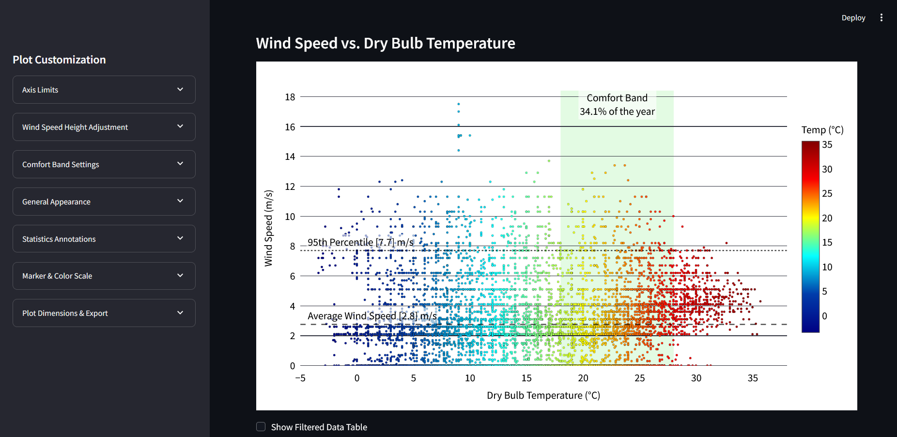
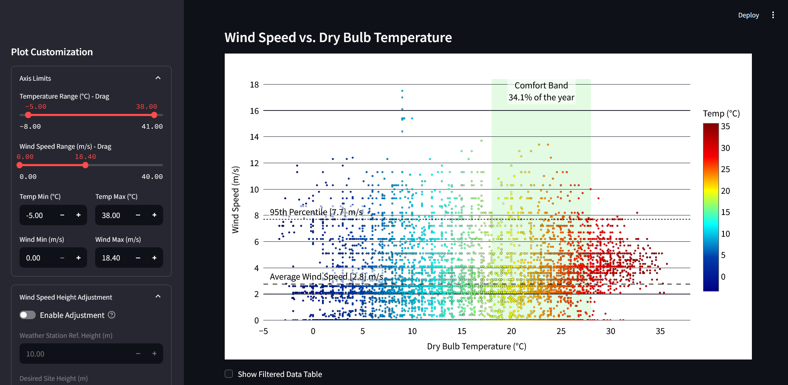
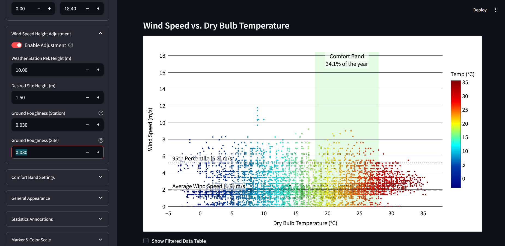
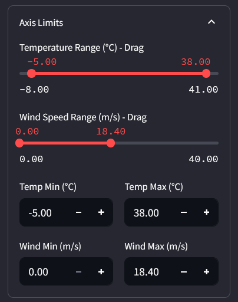
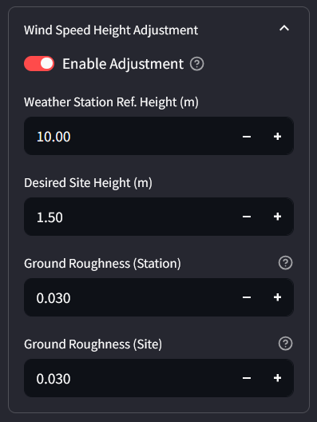
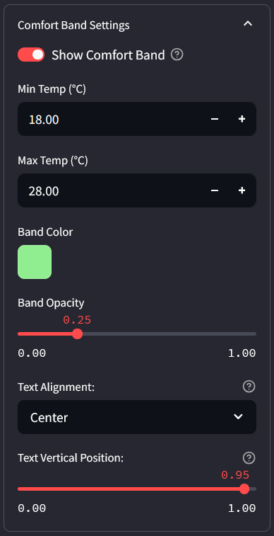
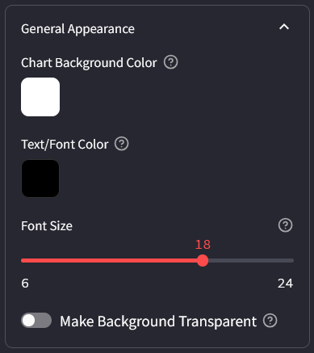
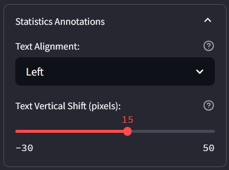
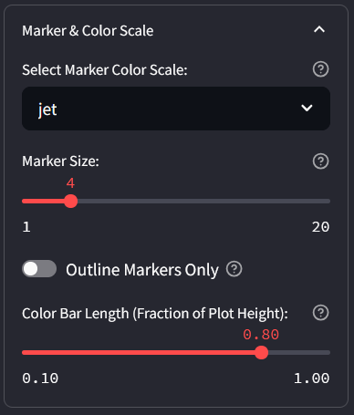
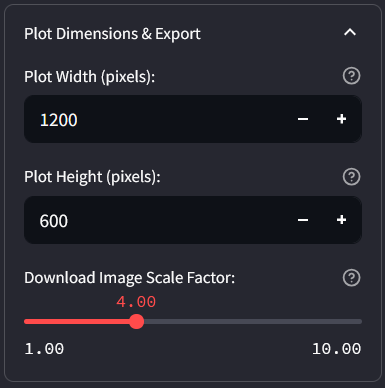

# Wind Temperature Visualizer

A Streamlit-based web application for visualizing wind and temperature data from EPW (EnergyPlus Weather) files. This tool provides interactive charts and analysis for weather data visualization and analysis.

## Features

- Interactive wind and temperature data visualization
- Support for EPW weather file format
- Real-time data filtering and analysis
- Responsive web interface built with Streamlit
- Comprehensive weather data insights
- Advanced axis configuration and customization
- Wind adjustment and comfort analysis tools
- Statistical analysis and data export capabilities
- Customizable marker colors and chart styling

## Screenshots

### Main Dashboard

*The main application interface showing the comprehensive weather data visualization dashboard with interactive charts and controls.*

### Interface Overview

*Complete overview of the application interface showcasing the layout and organization of various analysis tools.*

### Data Controls

*Advanced data control panel allowing users to filter, manipulate, and customize their weather data analysis.*

### Axis Configuration


*Detailed axis configuration options for customizing chart displays and data representation.*

### Wind Adjustment Panel


*Specialized wind data adjustment tools for fine-tuning wind speed and direction analysis.*

### Comfort Analysis


*Thermal comfort analysis features providing insights into human comfort conditions based on weather data.*

### General Settings


*General application settings and configuration options for customizing the user experience.*

### Statistics Panel


*Comprehensive statistical analysis panel showing detailed metrics and calculations for weather data.*

### Marker Color Options


*Customizable marker color settings for enhanced data visualization and chart aesthetics.*

### Chart Export Features


*Professional chart export capabilities allowing users to save and share their visualizations in various formats.*

## Installation

### Prerequisites

- Python 3.7 or higher
- pip package manager

### Setup Instructions

1. Clone the repository:
```bash
git clone https://github.com/yourusername/wind-temperature-visualizer.git
cd wind-temperature-visualizer
```

2. Install dependencies:
```bash
pip install -r requirements.txt
```

3. Run the application:
```bash
streamlit run src/wind_temp_visualizer.py
```

## Usage

1. Launch the application using the command above
2. Upload your EPW weather data file
3. Explore the interactive visualizations
4. Filter and analyze the data as needed
5. Customize charts using the advanced configuration options
6. Export your analysis and visualizations

## File Structure

```
wind-temperature-visualizer/
├── src/                    # Source code
├── scripts/               # Installation and utility scripts
├── docs/                  # Documentation
├── examples/              # Sample EPW files and usage examples
├── tests/                 # Test files
├── screenshots/           # Application screenshots and interface examples
├── requirements.txt       # Python dependencies
├── .gitignore            # Git ignore rules
├── LICENSE               # MIT License
├── FEATURES.md           # Detailed feature documentation
└── README.md             # This file
```

## Dependencies

- streamlit: Web application framework
- pandas: Data manipulation and analysis
- plotly: Interactive plotting library
- pvlib: Solar position and irradiance modeling
- numpy: Numerical computing

## Contributing

Contributions are welcome! Please feel free to submit a Pull Request.

## License

This project is licensed under the MIT License - see the [LICENSE](LICENSE) file for details.

## Acknowledgements

This project was developed with assistance from:
- **Google Gemini 2.5 Pro** - Advanced AI assistance for application architecture and feature development
- **OpenAI ChatGPT o3** - AI-powered code optimization and documentation enhancement

Special thanks to the AI development community for providing powerful tools that enable rapid prototyping and professional application development.

## Support

If you encounter any issues or have questions, please open an issue on GitHub.
